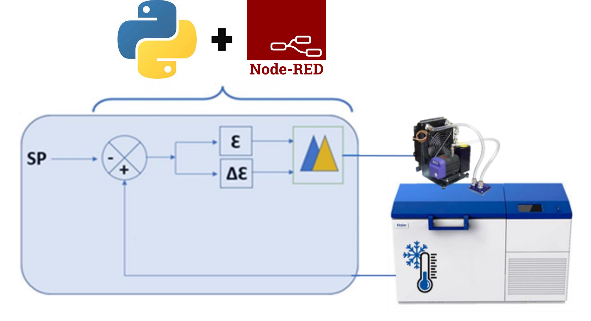
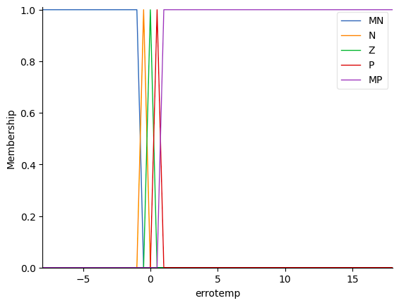
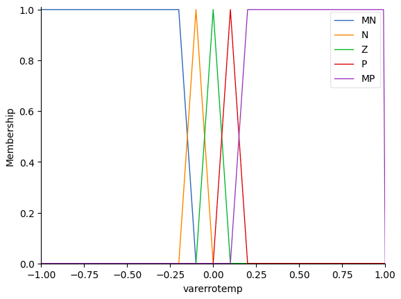
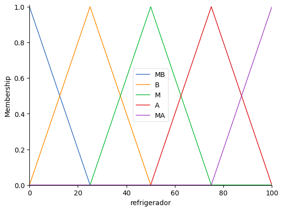

# Controle Fuzzy para Sistema de Refrigeração

Este projeto implementa um controlador fuzzy aplicado a um sistema de refrigeração, utilizando a linguagem **python**, **node-red** e **mosquitto**. O controlador fuzzy recebe como entradas o erro e a variação do erro, enquanto a saída corresponde à potência do refrigerador. A imagem abaixo ilustra o funcionamento geral do projeto:



## Pré-requisitos:
- Node.js (used v18.17.1);
- Node-red;
- Python (used v3.8.10)
- Jupyter Notebook;

## Entradas Fuzzy

### Erro (e)
- **MN (Muito Negativo):** Indica um erro muito negativo. Ou seja, está muito frio.
- **N (Negativo):** Indica um erro negativo. Ou seja, está frio.
- **Z (Zero):** Indica um erro próximo a zero. 
- **P (Positivo):** Indica um erro positivo. Ou seja, está quente.
- **MP (Muito Positivo):** Indica um erro muito positivo. Ou seja, está muito quente.

A imagem abaixo permite visualizar os itens descritos acima:



### Variação do Erro (de)
- **MN (Muito Negativa):** Indica uma variação do erro muito negativa. Ou seja, está esfriando muito.
- **N (Negativa):** Indica uma variação do erro negativa. Ou seja, está esfriando.
- **Z (Zero):** Indica uma variação do erro próxima a zero.
- **P (Positiva):** Indica uma variação do erro positiva. Ou seja, está esquentando.
- **MP (Muito Positiva):** Indica uma variação do erro muito positiva. Ou seja, está esquentando muito.

A imagem abaixo permite visualizar os itens descritos acima:



## Saída Fuzzy

### Potência do Refrigerador
- **MB (Muito Baixa):** Indica uma potência do refrigerador muito baixa.
- **B (Baixa):** Indica uma potência do refrigerador baixa.
- **M (Média):** Indica uma potência do refrigerador média.
- **A (Alta):** Indica uma potência do refrigerador alta.
- **MA (Muito Alta):** Indica uma potência do refrigerador muito alta.

A imagem abaixo permite visualizar os itens descritos acima:



## Integração com Mosquitto (Broker MQTT)

O projeto utiliza a biblioteca Paho para enviar os dados do erro e temperatura para um broker MQTT (Mosquitto).

## Visualização de Dados com Node-RED

Os dados enviados para o broker MQTT podem ser visualizados e monitorados usando o Node-RED. O Node-RED oferece uma interface gráfica amigável para criar fluxos de dados, facilitando a compreensão e análise dos resultados do sistema.

## Execução do Projeto

1. **Configuração do Ambiente:**
   Certifique-se de ter todas as dependências instaladas: Jupyter Notebook.

2. **Execução do Jupyter Notebook:**
   Execute o notebook Jupyter principal do projeto para iniciar o sistema de refrigeração com o controlador fuzzy.

3. **Instalação do Node-RED:**
   A instalação do node-red requer previamente o node.js instalado.

   ```shell
    sudo npm install -g --unsafe-perm node-red
   ```

   Depois instale o pacote para poder visualizar os dados graficamente:

   ```shell
    npm install node-red-contrib-ui-timelines-chart
   ```

4. **Análise de Resultados:**
   Analise os resultados do sistema de refrigeração com o controlador fuzzy através do notebook e visualize os dados no Node-RED.

## Integrantes

*   [Fernanda Nagata Ito](https://github.com/FerNagata)
*   [João Henrique Silva Delfino](https://github.com/Joaohsd)
*   [Paulo Otávio Luczensky](https://github.com/PauloLuczensky)